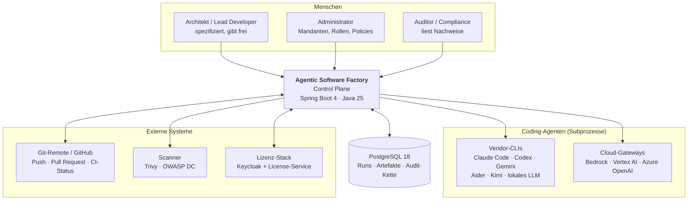
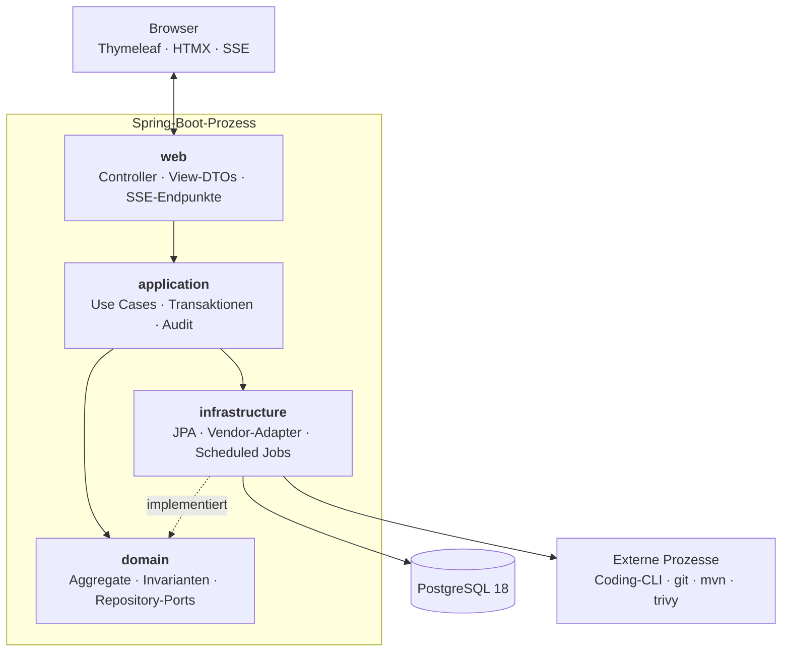
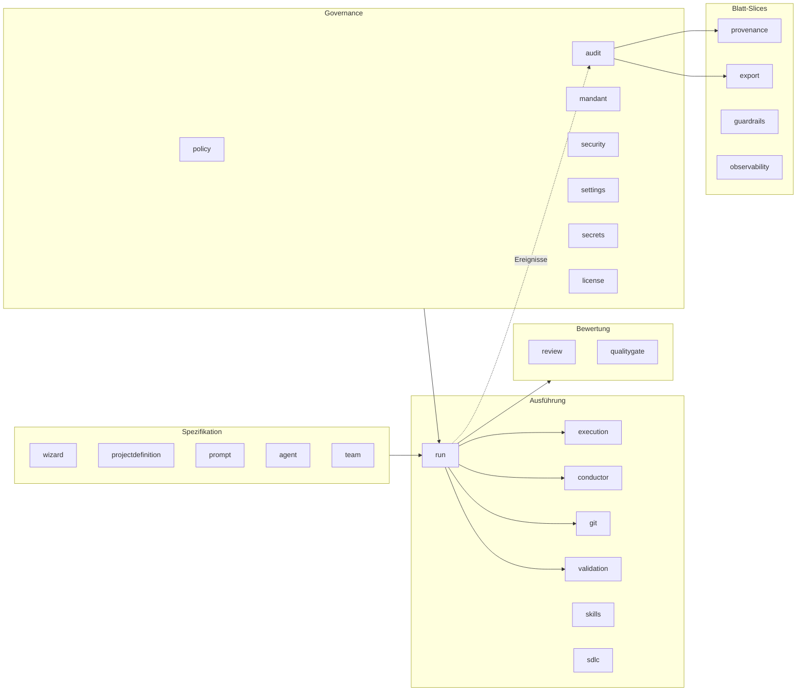
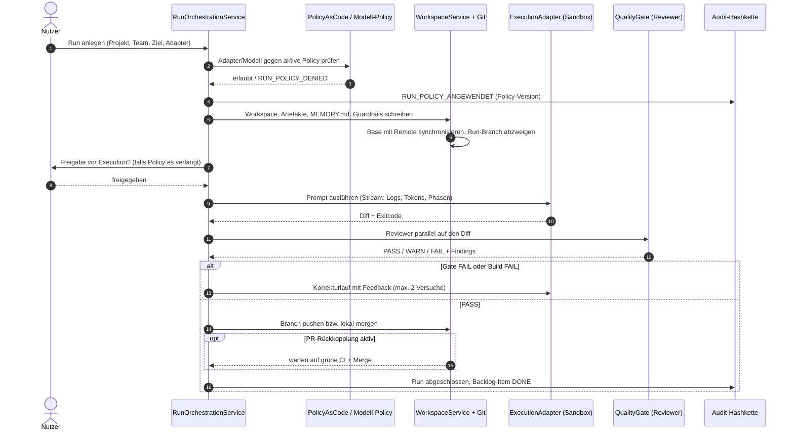
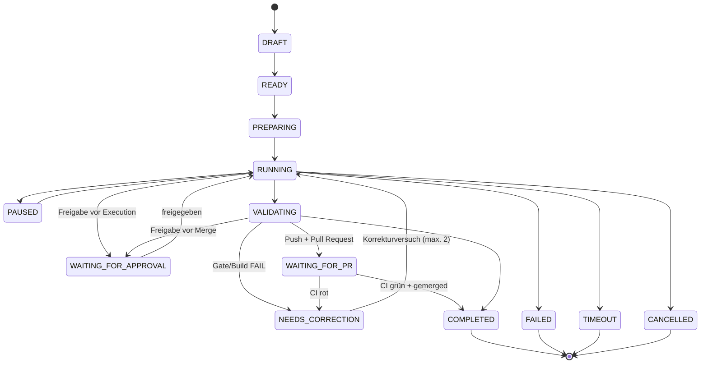
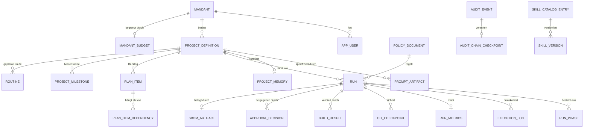
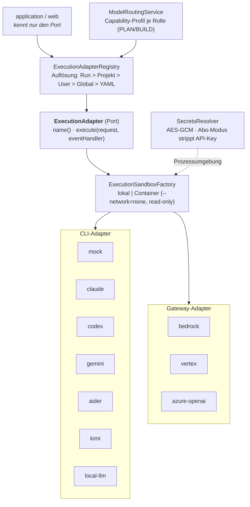
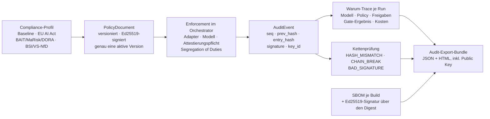
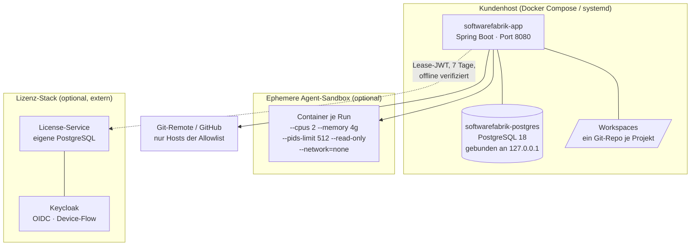
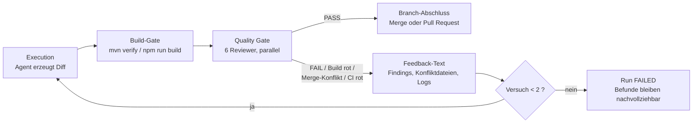

# 3. Systemdiagramme

Neun Diagramme als Mermaid-Quelltext. Die Nummerierung schließt an das
Abbildungsverzeichnis von v1.3 an (dort endet es bei Abbildung 20), damit die
Vorschläge direkt übernommen werden können.

Rendern für LaTeX z. B. mit
`mmdc -i diagramm.mmd -o abbildungen/abb21.pdf -b transparent`.

---

## Abbildung 21 — Systemkontext

*Bildunterschrift:* Systemkontext der Agentic Software Factory: eine Control
Plane zwischen Mensch, Coding-Agenten und Zielrepository.

---

## Abbildung 22 — Bausteinsicht (Container/Schichten)

*Bildunterschrift:* Bausteinsicht: modularer Monolith mit Ports-and-Adapters
pro Slice; externe Werkzeuge ausschließlich hinter Ports.

> Regel im Bild: Pfeile zeigen ausschließlich nach innen bzw. auf Ports.
> Die Rückrichtung (`domain → application/web`) ist per ArchUnit ausgeschlossen.

---

## Abbildung 23 — Slice-Landkarte

*Bildunterschrift:* Fachliche Slices der Fabrik, gruppiert nach Aufgabe.
Blatt-Slices (`provenance`, `export`, `guardrails`) konsumieren nur.

---

## Abbildung 24 — Laufzeitablauf eines Runs

*Bildunterschrift:* Laufzeitablauf eines Build-Runs von der Anlage bis zum
Merge, inklusive Korrekturschleife und Approval-Punkten.

---

## Abbildung 25 — Zustandsautomat des Runs

*Bildunterschrift:* Zustandsmodell eines Runs. Alle Übergänge sind zentral
in `RunStatusTransitions` hinterlegt; unerlaubte Übergänge werfen.

---

## Abbildung 26 — Datenmodell (Ausschnitt)

*Bildunterschrift:* Kernaggregate des Datenmodells. Vollständig: 39 Tabellen,
37 Flyway-Migrationen.

---

## Abbildung 27 — Adapter- und Modellschicht

*Bildunterschrift:* Vendor-Neutralität durch einen Port: Application- und
Web-Schicht kennen ausschließlich `ExecutionAdapter` (ArchUnit-erzwungen).

---

## Abbildung 28 — Governance- und Nachweiskette

*Bildunterschrift:* Von der Policy bis zum Auditbericht: jede Durchsetzung
erzeugt ein signiertes Kettenglied.

---

## Abbildung 29 — Deployment

*Bildunterschrift:* Deployment-Sicht: ein Anwendungscontainer, eine Datenbank,
optional getrennter Lizenz-Stack. Air-Gap-fähig.

---

## Optional: Abbildung 30 — Korrekturschleife im Detail

*Bildunterschrift:* Die Korrekturschleife als Regelkreis — Befunde werden zu
Eingaben des nächsten Laufs.

